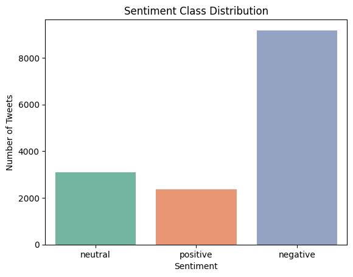
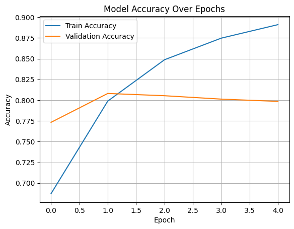
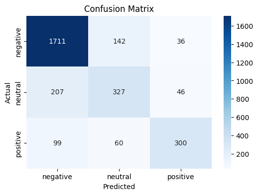

# twitter-airline-sentiment-lstm
An end-to-end sentiment classification pipeline leveraging LSTM networks on authentic Twitter data. Accurately predicts positive, neutral, and negative sentiments for U.S. airline tweets with an accuracy exceeding 80%.
# ✈️ Twitter Airline Sentiment Analysis using LSTM

This repository showcases an end-to-end sentiment classification pipeline applied to Twitter data related to major U.S. airlines. Leveraging deep learning with LSTM (Long Short-Term Memory) networks, the project aims to extract and predict public sentiment from real-world social media posts.

---

## 📚 Dataset Overview

- **Source**: [Kaggle - Twitter US Airline Sentiment](https://www.kaggle.com/datasets/crowdflower/twitter-airline-sentiment)
- **Size**: 14,640 labeled tweets
- **Sentiment Classes**:
  - `positive`
  - `neutral`
  - `negative`

The dataset contains tweets labeled for sentiment in the context of various U.S. airlines, making it an excellent real-world resource for natural language processing tasks.

---

## 🛠️ Technologies & Libraries

| Tool/Library    | Purpose                              |
|----------------|--------------------------------------|
| Python          | Core programming language            |
| TensorFlow & Keras | Deep learning & LSTM implementation |
| Pandas / NumPy  | Data manipulation and preprocessing  |
| Matplotlib / Seaborn | Data visualization               |
| Scikit-learn    | Label encoding, evaluation metrics   |

---

## 🔍 Project Pipeline

1. **Data Cleaning**  
   - Removed URLs, Twitter handles, hashtags, and special characters  
   - Converted text to lowercase

2. **Label Encoding**  
   - Sentiment labels were transformed into numeric format for model training

3. **Tokenization & Padding**  
   - Utilized `Tokenizer` from Keras to convert text into sequences  
   - Applied sequence padding to ensure consistent input length for LSTM

4. **Model Architecture**  
   - Embedding Layer (with 5000 vocab size and 64-dimensional vectors)  
   - Single-layer LSTM (64 units with dropout)  
   - Fully connected Dense layer with Softmax activation (3-class output)

5. **Training & Validation**  
   - 5 epochs  
   - Batch size: 64  
   - Validation split: 20%

---

## 📈 Results & Evaluation

| Metric         | Value   |
|----------------|---------|
| **Test Accuracy** | ~79.85% |
| **Test Loss**     | ~0.54   |

The model demonstrates solid generalization on unseen test data, achieving nearly 80% accuracy in sentiment prediction across three classes.

---

## 🖼️ Visual Insights

<p float="left">
  
  
  
</p>

- **Left**: Distribution of sentiment classes across the dataset  
- **Center**: Accuracy over training epochs  
- **Right**: Confusion matrix on test predictions

---

## 🤖 Sample Predictions

```python
"I had a great flight experience with United Airlines!" → Sentiment: positive  
"My flight was delayed for 5 hours. Very disappointed." → Sentiment: negative  
"Nothing special, just a regular trip." → Sentiment: neutral  

